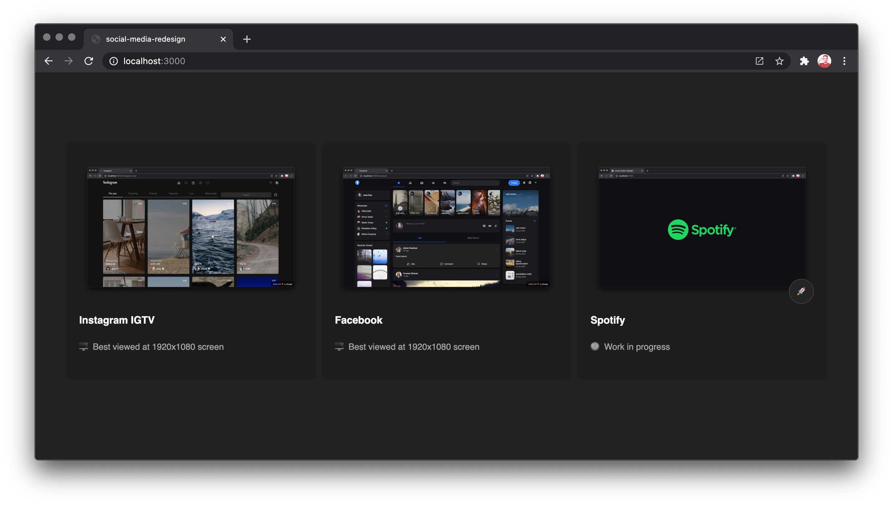

[](https://social-media-redesign-chcepe.vercel.app/)

# 🌙 social-media-redesign

A collection of social media dark mode redesign concept.

Written in `React` and `TypeScript`, together with `styled-components`.

## Setup

1.  Clone the repository.

```
git clone https://github.com/chcepe/social-media-redesign.git
```

2.  Install dependencies `npm install` or `yarn install`
3.  Start the app `npm run dev` or `yarn dev`
4.  Browse [localhost:3000](http://localhost:3000/) in your browser of choice

### Available social media brands:

| Name         | Brand name       | Preview                                                                |
| ------------ | ---------------- | ---------------------------------------------------------------------- |
| Instagram TV | `instagram-igtv` | [Link](https://social-media-redesign-chcepe.vercel.app/instagram-igtv) |
| Facebook     | `facebook`       | [Link](https://social-media-redesign-chcepe.vercel.app/facebook)       |

## Notes

This project is created with Next.JS without much configuration, only absolute imports at `tsconfig.json`, therefore the structure for this project looks like this:

```
├── assets
│   ├── <brand-name>
│   └── shared
├── components
│   ├── <brand-name>
│   └── shared
├── containers
│   ├── <brand-name>
│   └── shared
├── pages
│   ├── <brand-name>
│   └── shared
├── public
│   ├── <brand-name>
│   └── index.tsx
├── utils
│   ├── <brand-name>
│   └── shared
├── .babelrc
├── package.json
├── README.md
└── tsconfig.json
```

You can create your own concept based from the available brands above.

## Deploy on Vercel

The easiest way to deploy a Next.js app is to use the [Vercel Platform](https://vercel.com/import?utm_medium=default-template&filter=next.js&utm_source=create-next-app&utm_campaign=create-next-app-readme) from the creators of Next.js.

Check out [Next.js deployment documentation](https://nextjs.org/docs/deployment) for more details
